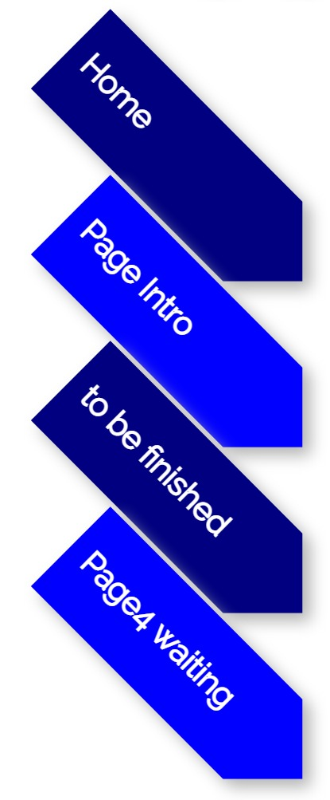

# Introduction

My home page interface is shown below:

Let me split it into different part and explain them respectively.

## Part 1

The icon in part 1 is like the logo of the website (just like google logo):

This logo represents the abbreviation "GJQ" of my name "Gu Jiaqi".
After taking the logo apart, you can see the three letters "GJQ":

## Part 2

Here, The first button "home" leads to my home page, and the second button "page intro" leads to the current introduction page. The following two buttons do not lead to any interface. In the future, if I have the opportunity, I will continue to improve the interface that the following two buttons may lead to (because now I lack personal data that can be added).

## Part 3

This is my full English name "Gu Jiaqi", which is also displayed in the form of logo, but it is placed vertically on the web page, which may not be easy to identify...

## Part 4
Part 4 is my picture. The photos are blurred, not because they haven't been loaded, but because the resolution of the photos is low.

## Part 5
The card has two side, click "next" and "back" to see the content on each side.

## Part 6
Personal info

## Part 7
Here are several ways to contact me. When the mouse hovers over thelogo, there will be animation effect. Clicking the logo will jump to the external link. For privacy reasons, the links I put are not to my personal account page, but just the official websites of these websites, mainly to show that there is no problem in the realization of functions. Click the "QR code" button below to display the QR code of these links.

QR code is mainly used to facilitate users to open these links with their mobile phone through QR code. You can click "back" to hide QR code

