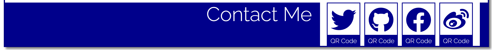

# Getting Started with Create React App

This project was bootstrapped with [Create React App](https://github.com/facebook/create-react-app).

## Available Scripts

In the project directory, you can run:

### `npm start`

Runs the app in the development mode.\
Open [http://localhost:3000](http://localhost:3000) to view it in the browser.

The page will reload if you make edits.\
You will also see any lint errors in the console.

### `npm test`

Launches the test runner in the interactive watch mode.\
See the section about [running tests](https://facebook.github.io/create-react-app/docs/running-tests) for more information.

### `npm run build`

Builds the app for production to the `build` folder.\
It correctly bundles React in production mode and optimizes the build for the best performance.

The build is minified and the filenames include the hashes.\
Your app is ready to be deployed!

See the section about [deployment](https://facebook.github.io/create-react-app/docs/deployment) for more information.

### `npm run eject`

**Note: this is a one-way operation. Once you `eject`, you can’t go back!**

If you aren’t satisfied with the build tool and configuration choices, you can `eject` at any time. This command will remove the single build dependency from your project.

Instead, it will copy all the configuration files and the transitive dependencies (webpack, Babel, ESLint, etc) right into your project so you have full control over them. All of the commands except `eject` will still work, but they will point to the copied scripts so you can tweak them. At this point you’re on your own.

You don’t have to ever use `eject`. The curated feature set is suitable for small and middle deployments, and you shouldn’t feel obligated to use this feature. However we understand that this tool wouldn’t be useful if you couldn’t customize it when you are ready for it.

## Learn More

You can learn more in the [Create React App documentation](https://facebook.github.io/create-react-app/docs/getting-started).

To learn React, check out the [React documentation](https://reactjs.org/).

### Code Splitting

This section has moved here: [https://facebook.github.io/create-react-app/docs/code-splitting](https://facebook.github.io/create-react-app/docs/code-splitting)

### Analyzing the Bundle Size

This section has moved here: [https://facebook.github.io/create-react-app/docs/analyzing-the-bundle-size](https://facebook.github.io/create-react-app/docs/analyzing-the-bundle-size)

### Making a Progressive Web App

This section has moved here: [https://facebook.github.io/create-react-app/docs/making-a-progressive-web-app](https://facebook.github.io/create-react-app/docs/making-a-progressive-web-app)

### Advanced Configuration

This section has moved here: [https://facebook.github.io/create-react-app/docs/advanced-configuration](https://facebook.github.io/create-react-app/docs/advanced-configuration)

### Deployment

This section has moved here: [https://facebook.github.io/create-react-app/docs/deployment](https://facebook.github.io/create-react-app/docs/deployment)

### `npm run build` fails to minify

This section has moved here: [https://facebook.github.io/create-react-app/docs/troubleshooting#npm-run-build-fails-to-minify](https://facebook.github.io/create-react-app/docs/troubleshooting#npm-run-build-fails-to-minify)

# Introduction

My home page interface is shown below:

Let me split it into different part and explain them respectively.

## Part 1

The icon in part 1 is like the logo of the website (just like google logo):

This logo represents the abbreviation "GJQ" of my name "Gu Jiaqi".
After taking the logo apart, you can see the three letters "GJQ":

## Part 2

Here, The first button "home" leads to my home page, and the second button "page intro" leads to the current introduction page. The following two buttons do not lead to any interface. In the future, if I have the opportunity, I will continue to improve the interface that the following two buttons may lead to (because now I lack personal data that can be added).

## Part 3

This is my full English name "Gu Jiaqi", which is also displayed in the form of logo, but it is placed vertically on the web page, which may not be easy to identify...

## Part 4
Part 4 is my picture. The photos are blurred, not because they haven't been loaded, but because the resolution of the photos is low.

## Part 5
The card has two side, click "next" and "back" to see the content on each side.

## Part 6
Personal info

## Part 7
Here are several ways to contact me. When the mouse hovers over thelogo, there will be animation effect. Clicking the logo will jump to the external link. For privacy reasons, the links I put are not to my personal account page, but just the official websites of these websites, mainly to show that there is no problem in the realization of functions. Click the "QR code" button below to display the QR code of these links.

QR code is mainly used to facilitate users to open these links with their mobile phone through QR code. You can click "back" to hide QR code

